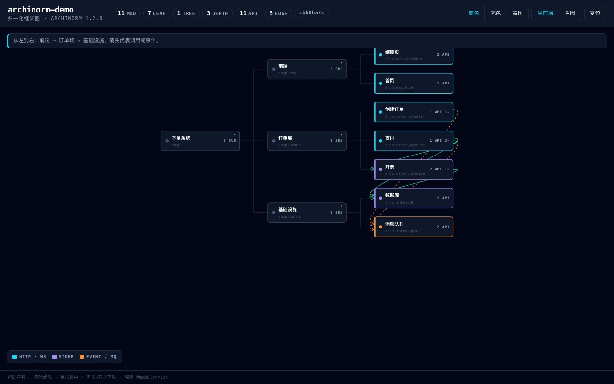
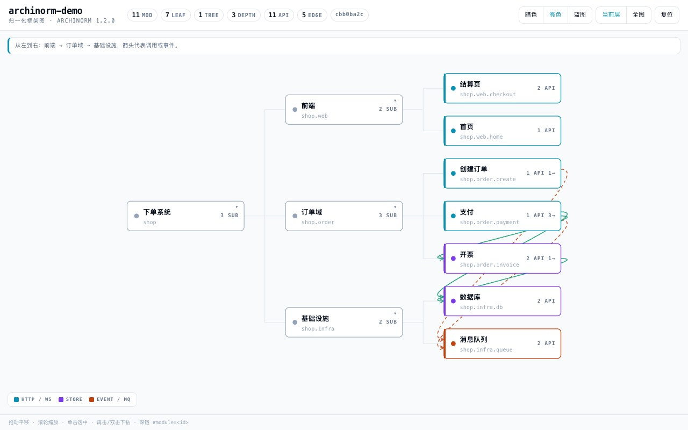
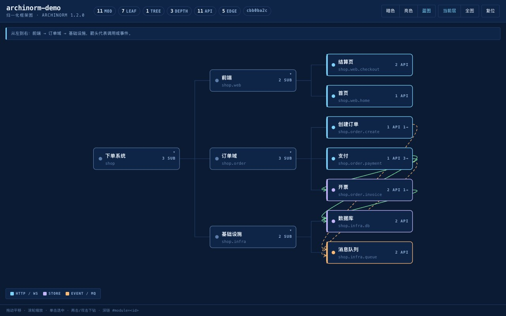

# 项目框架·归一化框架图构建器（archinorm）

> 把代码仓库的架构写成**归一化的分形模块树**，渲染成**深色交互式框架图**。
> 一个 Agent 技能，WorkBuddy / Claude Code / Codex 通用。**零第三方依赖**。

[](#)
[](#)
[](#)
[](LICENSE)


<sub>选中模块 → 再击下钻 → 翻「依赖 / 接口」页签 → 切暗色 / 亮色 / 蓝图</sub>

---

## 它解决什么问题

读一个陌生仓库，你得靠猜：模块在哪、谁调谁、改这里会波及什么。
手画架构图又画不动 —— 而且代码一改，图就成了谎言。

archinorm 把结构从代码里**抽出来存成数据**，图只是它的一个视图：

- **图会过期，数据不会。** 结构数据跟代码走 `sync` 增量更新，图随时重渲染。
- **人机共读。** 每个模块是一份 Markdown：`description` 给人读，`apis` / `deps` 给工具校验。
- **能当契约用。** `0 error` 门禁 + 冻结回执，让"架构没走样"可验证。

## 输入 → 输出

两条命令，只读扫描，**不改一行业务代码**：

```bash
python bin/archinorm.py inventory --repo ~/proj/myapp        # 先只读清点，看会生成什么
python bin/archinorm.py migrate   --repo ~/proj/myapp --dir ~/arch --render
```

真实输出（对 11 个文件的仓库）：

```
[OK ] migrate
  scanned_files: 11
  modules: 6        leaves: 3        max_depth: 3
  errors: 0         warnings: 5
  next_step: description 全部是【待审】占位，需人工补全 zh/en 后重跑 validate
```

产物是一个**能进 Git 的目录**，不是一张死图：

```
~/arch/archinorm-myapp/
├── modules/            分形模块树：一模块一份 Markdown（frontmatter 机器读，正文人读）
│   ├── myapp/index.md           根
│   ├── myapp/auth.md            叶子
│   └── myapp/order/pay/index.md 容器（文件形态由工具自动升降级）
├── renders/            每个容器一份渲染数据（顺序 / 分组 / 布局模式 / 阅读导语）
├── changes/            变更日志，随结构一起回档
├── policy.yml          架构规则（禁环 / 层方向 / 命名 / 深度…）
├── architecture.html   ← 交互式框架图，双击浏览器打开，单文件无外链
├── tree.json           渲染器输入
├── outline.md          人读大纲
├── api-index.json      API 键 → 所属模块
└── receipt.json        冻结回执（含结构 digest，可复算校验）
```

> ⚠️ `migrate` 产出的是**骨架**：`description` 是 `【待审】`占位、叶子 `apis` 为空。
> 补全之后才是上面动图里那张能读的图 —— 动图演示的正是补全后的状态。

## 演示界面

动图里出现的操作，对照如下：

| 操作 | 效果 |
|---|---|
| 拖动 / 滚轮 | 平移 / 缩放 |
| 单击节点 | 选中 —— 上下游点亮、无关节点淡出，右侧浮出详情面板 |
| 再击 / 双击容器 | **下钻进该模块**，画布换成它的子层（分形递归） |
| 面板四页签 | 概览 / **接口** / **依赖** / 元数据 |
| 阅读导语 | 画布上方一条导语带，来自该层的 `renders/<id>.json` 的 `reading` |
| 分组框 | 该层 `mode: groups` 时，按 `groups` 画虚线框 + 标题（演示里下钻「前端」可看到「入口 / 交易」） |
| `#module=<id>` | 深链直开某个模块 |
| 顶部三钮 | 暗色 / 亮色 / 蓝图；当前层 / 全图 / 复位 |

**层怎么画，由 `renders/<id>.json` 决定**：`order` 排阅读顺序（生产者 → 消费者）、
`reading` 写一句导语、`groups` 划领域边界、`edge_hints` 给单条边定车道。
哪些字段已落地、哪些还只是 schema 占位，`help renders` 里逐个标了 ✅ / ⚠️。

「依赖」页签列出该模块的**出向与入向**关系，例如支付模块：

```
向     类型      目标
OUT    call     开票        开票
OUT    event    消息队列     发布支付完成
OUT    call     数据库       更新订单状态
```

## 预览：同一张图，三套主题

| 暗色（默认） | 亮色 | 蓝图 |
|---|---|---|
|  |  |  |

三套主题共享同一套语义色词汇 —— 换的是材质与对比度，不是信息优先级。

## 读懂一个真实仓库

陌生仓库到手，推荐这条路径：

```bash
python bin/archinorm.py migrate --repo <仓库> --dir ./arch --render    # ① 出一版骨架
python bin/archinorm.py search  --dir ./arch/archinorm-<slug> --q 订单  # ② 按关键词定位模块
python bin/archinorm.py deps    --dir ./arch/archinorm-<slug> --id <模块>  # ③ 谁依赖它 / 它依赖谁
python bin/archinorm.py brief   --dir ./arch/archinorm-<slug> --id <模块>  # ④ 改这个模块的开发指引
python bin/archinorm.py sync    --dir ./arch/archinorm-<slug> --repo <仓库> # ⑤ 代码变了，找脏子树
```

`architecture.html` 是给人看的入口；`brief` / `deps` / `api-index.json`
是给 AI 的入口 —— 同一个结构，两种读法。

## 语义色

颜色只表示含义，不做装饰。按模块承载的协议自动判定：

| 颜色 | 含义 | 触发条件 |
|---|---|---|
| 🟦 青 `#22D3EE` | HTTP / WS | 叶子含 http / ws / graphql 接口 |
| 🟩 绿 `#34D399` | RPC / CALL | 叶子含 rpc / grpc 接口；`call` 依赖边 |
| 🟪 紫 `#A78BFA` | 存储 | 叶子含 mysql / redis / file 接口 |
| 🟧 橙 `#FB923C` | 事件 / MQ | 叶子含 kafka / amqp 接口；`event` 依赖边 |
| 🟨 琥珀 `#FBBF24` | 计划态 | `state: planned` |
| ⬜ 灰 `#94A3B8` | 其它 / 废弃 | `state: deprecated` 或未归类 |

边按语义分型：`call` 实线、`event` 虚线、`reference` 点线。

## 三分钟上手

```bash
git clone https://github.com/1791986214/archinorm.git
cp -R archinorm/skill ~/.workbuddy/skills/archinorm
# Windows: 复制 skill\ 到 %USERPROFILE%\.workbuddy\skills\archinorm
```

Windows 也可解压后双击 `package/install.bat`（已存在同名目录会先**改名备份**，绝不删除）。
装完重启 WorkBuddy，说「给这个项目画架构图」即可。

## 30 个命令

| 分组 | 命令 |
|---|---|
| 迁移 | `inventory` `migrate` `migrate-all` |
| 项目 / 模块 | `init` `upsert` `patch` `get` `list` `delete` `move` `promote` |
| 校验编译 | `validate` `build` `render` `fingerprint` |
| 检索 | `search` `deps` `brief` `sync` |
| 渲染数据 | `layout-get` `layout-upsert` `layout-delete` |
| 变更 | `change-open` `change-update` `change-list` `change-close` |
| 规则 | `policy-get` `policy-upsert` `check` |
| 帮助 | `help` |

不确定参数就跑 `python bin/archinorm.py help tool:<命令名>`，别猜。

## 为什么用 archinorm

- **图是视图，不是产物。** 结构数据可 diff、可 review、可进 Git；
  图随时从数据重渲染，改代码不会让图变成谎言。
- **分形递归。** 每个模块结构完全相同，点开即子层 —— 没有"这层特殊、那层另说"。
- **零依赖。** Python ≥ 3.9 即可；YAML 有 PyYAML 就用，没有自动切内置解析器。
  生成图**完全离线**。
- **自带更新。** `bin/skillup.py` 盯源仓库自动更新：备份 → 替换 → 自检 → 失败回滚。

## 自动更新

```bash
python skill/bin/skillup.py status            # 当前版本 / 源仓库 / 上次检查 / 备份
python skill/bin/skillup.py check --force     # 强制联网查新版
python skill/bin/skillup.py update            # 备份 + 替换 + 自检，失败自动回滚
python skill/bin/skillup.py rollback          # 后悔了
```

`run.sh` / `run.bat` 启动时内置「每天最多一次」静默检查（24 小时节流）。
五条硬护栏：只动自己 / 绝不删除 / 自检门禁 / 静默降级 / 24 小时节流。

> ⚠️ 知识库（乐享 / 网盘等）不提供更新能力 —— 它只是文件仓库，存的是上传那一刻的快照。
> 自动更新必须回到源仓库。详见 `skill/examples/README-AUTO-UPDATE.md`。

## 仓库结构

```
archinorm/
├── skill/                 要落到 ~/.workbuddy/skills/archinorm 的内容
│   ├── SKILL.md           技能说明（铁律 / 三条主流程 / 交付标注）
│   ├── manifest.json      版本 + 更新源声明
│   ├── bin/               引擎、启动器、更新器、构建脚本、源码分段
│   ├── examples/          archify 更新源样例 + 自动更新说明
│   ├── references/SPEC.md 完整规范（数据模型 / 诊断码分级 / 31→30 映射）
│   └── tests/selftest.py  73 项断言
├── package/               分发用一键脚本（安装 / 卸载 / 更新）
├── docs/                  演示动图与三主题预览图
├── tools/                 演示资产构建脚本（CDP 录屏 + GIF 合成）
└── VERSION  CHANGELOG.md  LICENSE  manifest.json
```

## 开发

```bash
python skill/bin/build.py                              # 由 skill/bin/parts/ 重新合并引擎
                                                       # （语法检查 / 单例守卫 / CLI 装配冒烟）
python skill/tests/selftest.py                         # 期望 73/73
ARCHINORM_NO_PYYAML=1 python skill/tests/selftest.py   # 零依赖路径也 73/73
```

演示动图由 `tools/` 两个脚本产出，可复现：

```bash
python tools/cdp_record.py    --cdp <ws-url> --js <交互脚本> --out <帧目录> --seconds 9
python tools/make_demo_gif.py --frames <帧目录> --out docs/demo.gif --width 880 --fps 12
```

## 依赖

**Python ≥ 3.9，无第三方库。** 生成架构图完全离线；只有自动更新需要联网。

## 致谢

- 结构语义与规范移植自 [yan-mc/dsh-normify](https://github.com/yan-mc/dsh-normify)（MIT, yan-mc）
  —— 原为 DeepSeek Harness 插件，31 个 `normify_*` 工具，本包收敛成 30 个 CLI 命令。
- 渲染器的视觉语言（Evidence Console：深色画布 / 全等宽字体 / 七语义色 / 扁平克制）
  吸收自 [tt-a1i/archify](https://github.com/tt-a1i/archify)（MIT）的 DESIGN.md。

## License

[MIT](LICENSE)
